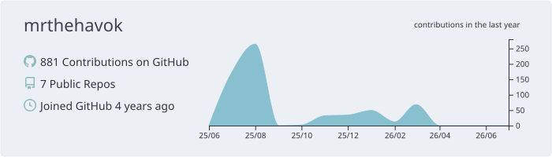
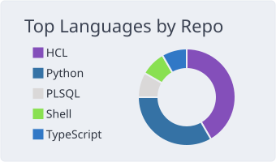

# mrthehavok

DevOps / Cloud engineer based in Spain.

  
  

## About me

I have 4+ years of hands-on AWS engineering experience and 12+ years in database engineering.
My focus is cloud architecture, cost optimization, migration delivery, and production reliability.

## What I do now

- Lead DevOps and cloud delivery for multi-account AWS environments.
- Build Kubernetes/GitOps platforms with observability and safe progressive delivery.
- Design migration and stabilization roadmaps with a strong reliability and DR focus.
- Apply AI SDLC practices with MCP servers and isolated Docker-based workflows.

## Core stack

  

## Secondary stack

  

## Certifications

- AWS Certified Solutions Architect – Associate
- AWS Certified Data Engineer – Associate
- AWS Certified SysOps Administrator – Associate
- AWS Certified Developer – Associate

## Languages

- English
- Russian
